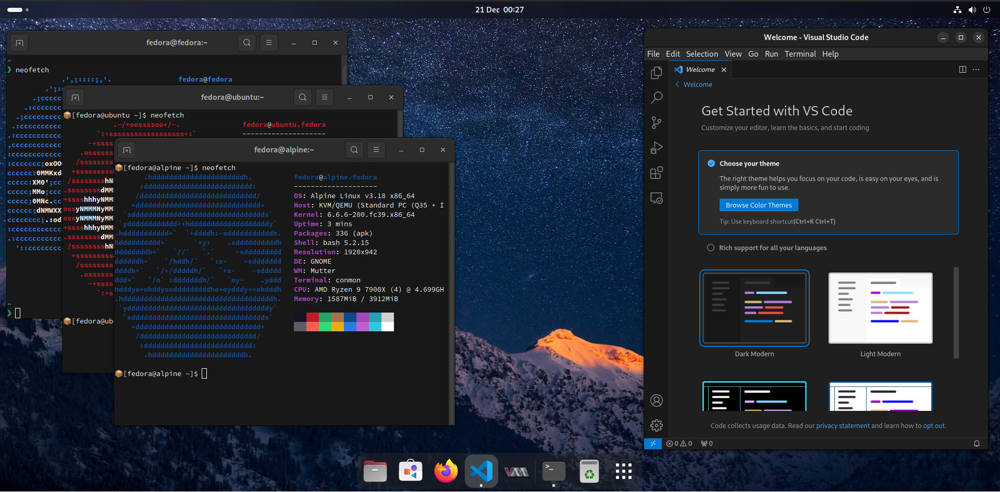

# Eternal Linux Images

> [!NOTE]
> This project should not be consumed directly by anyone.  It should be used as a reference when building your own images.
> This is my opinionated image and includes everything I use for day-to-day tasks, plus is used for testing new features before contributing them to [Universal Blue](https://github.com/ublue-os/).
>
> Interested users are advised to consume images from [Universal Blue](https://github.com/ublue-os/) instead due to the larger community of maintainers and committment to providing support for their images.  They also provide guidance on creating your own image.

A collection of Immutable Linux Desktop images from the Eternal Linux project.  All images provided are highly opinionated and represent my personal preferences for a Linux desktop. Feel free to clone and modify these images to suit your own needs.

## Images

### Lumina

| Desktop Environment | Intended Usage | Description | Is Stable | ISOs |
| ------------------- | -------------- | ----------- | --------- | --- |
| GNOME               | DevOps         | A desktop optimised for DevOps | Yes | [Regular](https://download.eternal.sturla.tech/lumina/lumina-stable-x86_64.iso) / [NVIDIA](https://download.eternal.sturla.tech/lumina/lumina-stable-nvidia-x86_64.iso) |
| COSMIC              | DevOps         | A desktop optimised for DevOps | Yes | [Regular](https://download.eternal.sturla.tech/lumina/lumina-cosmic-stable-x86_64.iso) / [NVIDIA](https://download.eternal.sturla.tech/lumina/lumina-cosmic-stable-nvidia-x86_64.iso) |


> The Lumina GNOME Desktop Environment featuring Distrobox and VSCode

An opinionated development environment featuring various tools for development and productivity baked in.
This image is perfect for any DevOps professionals who want to get up and running with a rock-solid desktop quickly.

Key features of this image include:
- Containerisation with Docker, Podman and Distrobox
- Virtualization using QEMU/KVM with virt-manager
- Development through DevContianers and Nix
- Local AI inference with Ollama
- Visual Studio Code
- Google Chrome & 1Password
- Additional CLI tools

#### Usage

You can either setup Lumina by installing the ISO (linked in the table above) or rebase through an existing Fedora Atomic Desktop installation.
To rebase to the image, you will need to have pre-installed a Fedora Atomic Desktop and run the following commands:

```bash
$ rpm-ostree rebase ostree-unverified-registry:ghcr.io/rsturla/eternal-linux/lumina:stable
$ systemctl reboot
$ eternal setup
```

When the system reboots, you will be presented with the Lumina desktop environment.
